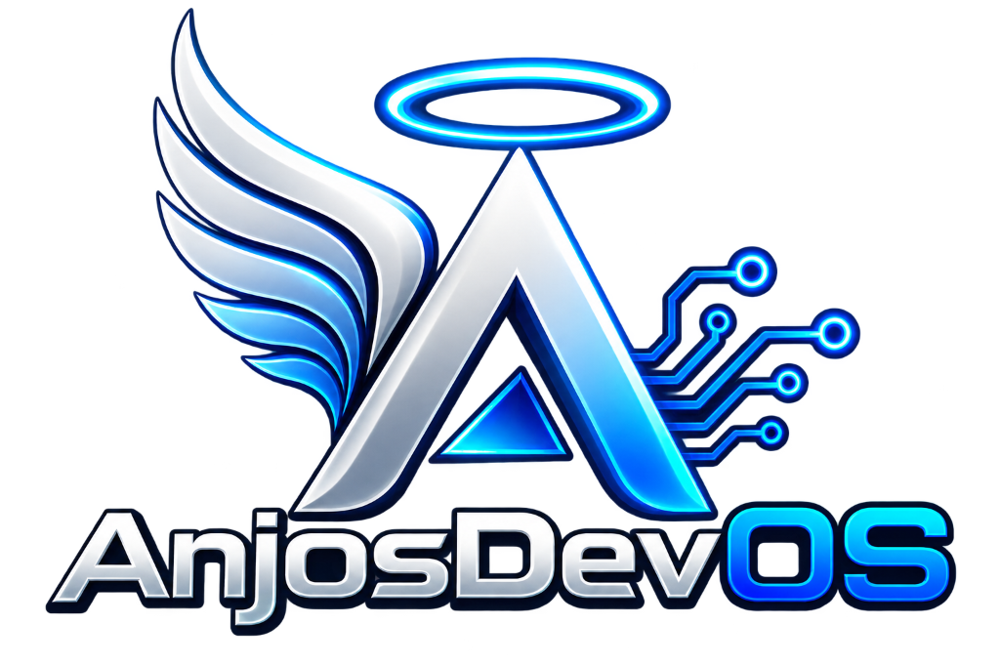
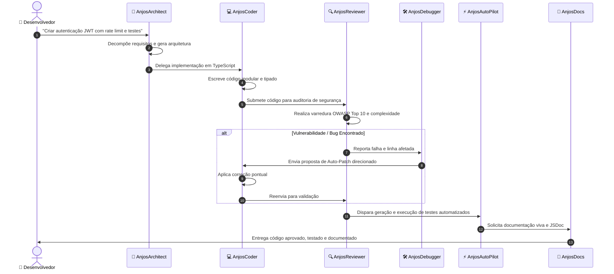

<div align="center">



# ⚡ AnjosDevOS
### Sistema Operacional de IA Autônomo para Desenvolvedores & Automação

[](https://nextjs.org/)
[](https://react.dev/)
[](https://typescriptlang.org/)
[](https://tailwindcss.com/)
[](LICENSE)

> Um sistema operacional completo baseado em navegador alimentado por um **Enxame de 7 Agentes Autônomos Independentes**, **27 apps nativos**, **Monaco Code IDE com IA Integrada**, **Automation Studio Visual com Execução em Tempo Real**, **50+ modelos de IA** e interfaces comutáveis **Cyberpunk** e **iOS**.

🔗 **Repositório Oficial:** [github.com/anjosdevpython/AnjosDevOS](https://github.com/anjosdevpython/AnjosDevOS)  
🌐 **Website do Desenvolvedor:** [allananjos.dev.br](https://allananjos.dev.br)  
👤 **Autor:** Allan Anjos (`allan@allananjos.dev.br`)

</div>

---

## 📑 Sumário

- [Visão Geral](#-visão-geral)
- [Arquitetura do Enxame de Agentes (Swarm Engine)](#-arquitetura-do-enxame-de-agentes-swarm-engine)
- [Especialistas do Enxame](#-especialistas-do-enxame)
- [Recursos Principais](#-recursos-principais)
  - [1. Monaco IDE com IA Swarm Integrada](#1-monaco-ide-com-ia-swarm-integrada)
  - [2. Automation Studio com Motor Visual em Tempo Real](#2-automation-studio-com-motor-visual-em-tempo-real)
  - [3. Barramento de Comunicação Inter-Agentes](#3-barramento-de-comunicação-inter-agentes)
  - [4. Interface Cyberpunk & Modo iOS](#4-interface-cyberpunk--modo-ios)
- [Apps Nativos do Sistema](#-apps-nativos-do-sistema-27)
- [Início Rápido](#-início-rápido)
- [Comandos de Terminal](#-comandos-de-terminal)
- [Documentação Técnica Adicional](#-documentação-técnica-adicional)
- [Licença e Créditos](#-licença-e-créditos)

---

## 🌟 Visão Geral

O **AnjosDevOS** é uma plataforma que transforma a experiência do desenvolvedor em um ecossistema operacional onde agentes de inteligência artificial não apenas respondem a prompts isolados, mas **colaboram ativamente entre si** em um ciclo contínuo de planejamento, escrita de código, auditoria de segurança OWASP, correção automática de bugs (auto-patch), deploy e documentação viva.

```
┌─────────────────────────────────────────────────────────────────────────────┐
│  ⚡ AnjosDevOS — Sistema Operacional de IA Autônomo                         │
├─────────────────────────────────────────────────────────────────────────────┤
│                                                                             │
│   [ 🧠 AnjosArchitect ] ──(Delega)──> [ 💻 AnjosCoder ]                     │
│            ▲                                  │ (Submete Código)            │
│            │                                  ▼                             │
│     (Coordena Enxame)                 [ 🔍 AnjosReviewer ]                  │
│            │                                  │ (Feedback / Auditoria)      │
│            │                                  ▼                             │
│   [ 📝 AnjosDocs ] <──(Documenta)── [ 🛠️ AnjosDebugger ]                   │
│            ▲                                  │ (Aplica Auto-Patch)         │
│            │                                  ▼                             │
│   [ 🚀 AnjosDevOps ] <──(Deploy)─── [ ⚡ AnjosAutoPilot ] (Workflows)       │
│                                                                             │
├─────────────────────────────────────────────────────────────────────────────┤
│ [INÍCIO] │ 💻 Code Editor │ ⚡ Automation │ 👥 Agent Teams │ 12:00 │ 📶 🔋  │
└─────────────────────────────────────────────────────────────────────────────┘
```

---

## 🧠 Arquitetura do Enxame de Agentes (Swarm Engine)

O núcleo do **AnjosDevOS** é alimentado pelo `SwarmEngine` (`src/lib/agent-swarm/`), estruturado sobre um barramento de mensagens assíncrono com suporte a pub/sub, filas de tarefas prioritárias e memória contextual compartilhada.



---

## 🤖 Especialistas do Enxame

| Agente | Função | Papel Principal | Ferramentas & Habilidades |
| :--- | :--- | :--- | :--- |
| **🧠 AnjosArchitect** | `LEAD` | Líder Técnico & Planejamento | Decomposição de tarefas, Clean Architecture, RFCs, Grafos de dependência |
| **💻 AnjosCoder** | `DEV` | Engenheiro Fullstack | TypeScript, Python, Go, Rust, React 19, Next.js, Refatoração, SQL |
| **🔍 AnjosReviewer** | `QA & SEC` | Auditoria & Segurança | OWASP Top 10, Análise Estática, Complexidade Ciclomática, Detecção de Smells |
| **🛠️ AnjosDebugger** | `FIX` | Diagnóstico & Auto-Patch | Rastreamento de Stack Traces, Causa Raiz, Correção de Vazamentos, Patches |
| **⚡ AnjosAutoPilot** | `AUTO` | Engenharia de Automação | Scraping de DOM, Pipelines REST/GraphQL, Triggers Cron, Webhooks |
| **🚀 AnjosDevOps** | `DEVOPS` | Infraestrutura & CI/CD | Docker, Kubernetes, GitHub Actions, Nginx, Healthchecks de Uptime |
| **📝 AnjosDocs** | `DOCS` | Redação Técnica & Manuais | JSDoc vivo, OpenAPI/Swagger, Diagramas Mermaid, Guias de Onboarding |

---

## 🚀 Recursos Principais

### 1. Monaco IDE com IA Swarm Integrada
- **Editor Profissional:** Editor Monaco completo com realce de sintaxe em 40+ linguagens, temas escuro/claro/alto contraste, minimap e atalhos de teclado.
- **Painel Lateral do Enxame (✨ IA Swarm):**
  - **Disparar Tarefas Autônomas:** Solicite refatoração, criação de módulos ou melhorias de código com feedback em tempo real de cada especialista.
  - **Auditoria de 1 Clique:** Analise conformidade de tipos, segurança e vulnerabilidades OWASP com nota de 0 a 100.
  - **Botão Auto-Corrigir:** Aplica patches gerados pelo `AnjosDebugger` diretamente no editor.
  - **Gerador de Testes Unitários:** Cria suítes de teste Vitest prontas para execução em nova aba.

### 2. Automation Studio com Motor Visual em Tempo Real
- **Builder Visual de Fluxos:** Conecte nós de gatilho (Cron, Webhook, Git Push), ações de IA (Architect, Coder, Reviewer, AutoPilot) e nós de saída.
- **Execução Interativa:** Acompanhe o fluxo executando nó a nó com animações de status e telemetria de logs no terminal integrado.
- **Gerador por IA (Prompt-to-Flow):** Descreva o que deseja automatizar em linguagem natural e o `AnjosAutoPilot` montará o grafo de nós e conexões instantaneamente.

### 3. Barramento de Comunicação Inter-Agentes
- Comunicação bidirecional contínua entre todos os agentes via `SwarmEngine`.
- Feed interativo em tempo real onde o usuário pode interagir diretamente com qualquer especialista ou realizar broadcasts para todo o enxame.
- Quadro de tarefas com status Kanban (`Pendente`, `Em Progresso`, `Concluído`).

### 4. Interface Cyberpunk & Modo iOS
- **Tema Cyberpunk:** Efeitos neon glow, painéis translúcidos em glassmorphism, terminal estilo hacker e design futurista.
- **Modo iOS:** Interface inspirada no iOS com Dynamic Island, Dock, widgets interativos de marca e suporte completo a gestos touch.
- **Layout Mobile:** Totalmente responsivo para smartphones e tablets com navegação otimizada por gestos.

---

## 🖥️ Apps Nativos do Sistema (27)

### 🤖 Inteligência Artificial & Agentes
- 💬 **Chat IA** — Conversação com streaming e múltiplos provedores (OpenAI, Anthropic, Google, DeepSeek).
- 👥 **Agent Teams** — Gestão e comunicação interativa com o Enxame de Agentes.
- 🕸️ **Orquestrador** — Painel de coordenação, raciocínio em cadeia e aprendizado de workflows.
- 🧠 **Memória** — Sistema de memória persistente e grafo de conhecimento.
- 🎨 **Gerador de Imagens** — DALL-E, Flux, Stable Diffusion e Recraft.
- 🎬 **Gerador de Vídeo** — Kling e Runway.
- 🎵 **Gerador de Música** — Suno V5.
- 🗣️ **Text-to-Speech** & 🔊 **Efeitos Sonoros** — Síntese de áudio.

### 🛠️ Codificação & Automação
- 💻 **Code Editor** — Monaco IDE com IA Swarm, auditoria de segurança e testes.
- ⚡ **Automation Studio** — Builder e executor de fluxos com IA.
- ⌨️ **Terminal** — Shell com comandos de enxame (`agents`, `swarm`, `audit`, `flows`).
- 📁 **File Explorer** — Navegador de arquivos e árvore de diretórios.
- 🛠️ **AI Tools** — Registro de skills e ferramentas de desenvolvimento.
- 🧩 **DevTools Hub** — Integração com Cursor, Windsurf, Cline e Aider.
- 🙌 **OpenHands** — Agent canvas autônomo.
- 💎 **Theia IDE** — Ambiente integrado para desenvolvimento.

---

## ⚡ Início Rápido

### Pré-requisitos
- Node.js 18+ ou 20+
- npm, pnpm ou yarn

### Instalação

```bash
# 1. Clonar o repositório
git clone https://github.com/anjosdevpython/AnjosDevOS.git
cd AnjosDevOS

# 2. Instalar as dependências
npm install

# 3. Iniciar o servidor de desenvolvimento
npm run dev
```

Abra [http://localhost:3000](http://localhost:3000) no seu navegador para acessar o **AnjosDevOS**.

### Build para Produção

```bash
npm run build
npm start
```

---

## ⌨️ Comandos de Terminal

Abra o app **Terminal** no AnjosDevOS para utilizar os comandos do enxame:

| Comando | Descrição |
| :--- | :--- |
| `agents` / `swarm-list` | Lista os 7 especialistas do enxame e suas habilidades |
| `swarm <objetivo>` | Dispara o enxame para planejar, codificar, auditar e testar |
| `audit <código>` | Executa auditoria de segurança OWASP e qualidade estática |
| `flows` / `automation` | Lista os fluxos de automação ativos |
| `models` | Exibe os modelos de IA disponíveis (Claude, GPT, Gemini, DeepSeek) |
| `neofetch` | Exibe o banner e especificações técnicas do AnjosDevOS |
| `clear` | Limpa a tela do terminal |
| `help` | Exibe o manual de ajuda dos comandos |

---

## 📚 Documentação Técnica Adicional

- 📘 [**Arquitetura e Colaboração de Agentes**](docs/AGENT_COLLABORATION.md) — Detalhamento dos protocolos de troca de mensagens e resolução de tarefas.
- 📗 [**Manual do Automation Studio**](docs/AUTOMATION_GUIDE.md) — Guia passo a passo para criação de pipelines de automação e triggers.
- 📙 [**Estrutura de Diretórios**](src/STRUCTURE.md) — Mapa técnico de módulos e componentes.
- 📕 [**Guia de Contribuição**](CONTRIBUTING.md) — Como contribuir e criar novos agentes.
- 📓 [**Notas de Lançamento (Changelog)**](CHANGELOG.md) — Histórico de versões e novidades da v2.0.

---

## 📄 Licença e Créditos

Distribuído sob a licença **MIT**. Consulte o arquivo [LICENSE](LICENSE) para mais detalhes.

Desenvolvido com 💙 e inovação por **Allan Anjos**.  
🌐 [allananjos.dev.br](https://allananjos.dev.br) · 🐙 [GitHub](https://github.com/anjosdevpython)
