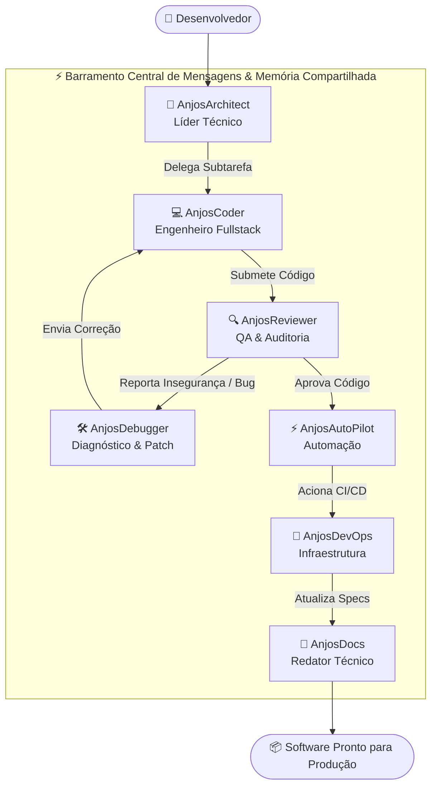

# 🧠 Protocolo de Colaboração e Enxame de Agentes — AnjosDevOS

Este documento detalha o funcionamento interno do **Swarm Engine** do AnjosDevOS, os papéis dos agentes especialistas e como ocorre a troca autônoma de mensagens e tarefas.

---

## 1. Visão Geral do Motor de Enxame

O enxame de agentes do AnjosDevOS foi desenhado para eliminar a necessidade de intervenção humana em tarefas mecânicas ou repetitivas de desenvolvimento e automação. Quando o usuário formula um objetivo de software, os agentes assumem papéis interdependentes.

---

## 2. Especialistas do Enxame

### 2.1 AnjosArchitect (Líder Técnico & Planejador)
- **Responsabilidade:** Interpreta a solicitação do usuário, avalia requisitos não-funcionais (escalabilidade, performance, segurança) e cria a decomposição de tarefas.
- **Saída:** Especificação de interfaces, modelo de dados e ordem de execução dos especialistas.

### 2.2 AnjosCoder (Engenheiro Fullstack)
- **Responsabilidade:** Escreve código limpo e tipado em TypeScript, React, Python, Go, Rust ou SQL.
- **Diretrizes:**
  - 100% livre do tipo `any` no TypeScript.
  - Princípios SOLID e Clean Architecture.
  - Funções puras e modulares.

### 2.3 AnjosReviewer (Auditor de Qualidade & Segurança)
- **Responsabilidade:** Avalia o código gerado em busca de vulnerabilidades (OWASP Top 10), injeções de SQL/XSS, vazamento de credenciais e complexidade excessiva.
- **Saída:** Relatório de auditoria com nota (0-100), classificação de severidade e sugestões práticas.

### 2.4 AnjosDebugger (Diagnóstico & Auto-Patch)
- **Responsabilidade:** Rastreia stack traces e exceções não tratadas, determinando a causa raiz e gerando patches corretivos que são enviados diretamente para o `AnjosCoder`.

### 2.5 AnjosAutoPilot (Engenheiro de Automação)
- **Responsabilidade:** Desenha e executa pipelines de automação, integrações via Webhook, scraping de páginas e chamadas encadeadas de APIs.

### 2.6 AnjosDevOps (Infraestrutura & Deploy)
- **Responsabilidade:** Configura pipelines de CI/CD, manifests Docker/Kubernetes e monitora a saúde das execuções.

### 2.7 AnjosDocs (Documentador Técnico)
- **Responsabilidade:** Garante que toda funcionalidade criada possua JSDoc completo, especificação OpenAPI e documentação técnica atualizada.

---

## 3. Tipos de Mensagens do Barramento

O barramento (`SwarmMessage`) suporta os seguintes tipos formais de comunicação:

1. `task_delegation`: Passagem formal de uma subtarefa de um agente para outro.
2. `code_submission`: Envio de código do `AnjosCoder` para análise do `AnjosReviewer`.
3. `review_feedback`: Devolução com nota de auditoria e apontamentos de qualidade.
4. `bug_report`: Relatório de falha encaminhado para o `AnjosDebugger`.
5. `patch_proposal`: Proposta de correção automática gerada pelo `AnjosDebugger`.
6. `automation_trigger`: Disparo de fluxo para o `AnjosAutoPilot`.
7. `deploy_request`: Solicitação de pipeline para o `AnjosDevOps`.
8. `docs_update`: Solicitação de geração de manuais para o `AnjosDocs`.
9. `broadcast`: Comunicado geral emitido para todos os agentes do enxame.
10. `user_query`: Ordem ou pergunta enviada diretamente pelo desenvolvedor.

---

## 4. Como Adicionar um Novo Agente ao Enxame

Para registrar um novo especialista:

1. Abra `src/lib/agent-swarm/agent-specialists.ts`.
2. Adicione um novo objeto ao array `SWARM_SPECIALISTS` implementando a interface `SwarmAgentDefinition`.
3. Defina o papel (`role`), o prompt de sistema especializado, as ferramentas disponíveis e os modelos de IA associados.
4. O `SwarmEngine` carregará o novo agente automaticamente na inicialização.
